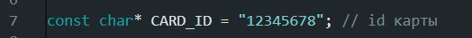

# EspVer - система входа через rfid карты

## О проекте

EspVer - устройство заменяющее ввод пароля пользователя. Работает по принципу HID, эмулируя клавиатуру и вводя заранее записанный пароль любой сложности. Данный проект позволяет не запоминать длинный и надежный пароль а так же исключает риск что пароль могут подсмотреть.

> *На данный момент устройство работает только оффлайн и сохраняет пароль в своей памяти.

---

## Принцип работы кода

### Ввод переменных

В начале кода заранее указывается пароль от пк и id карты. Для карты я использовал mifare classic 1k. Id карты пишется в 4 блоке. Для записи id на карту я использовал ту же схему, только с другой прошивкой. В прошивке программатора id карты тоже указывается в начале. В void loop устройство ожидает карту, если устройство сканировало карту и она является mifare classic а так же ее id совпал, запускается блок кода на ввод пароля.

### Ввод пароля

Перед вводом пароля нажимается стрелочка. Она нужна чтобы открыть окно ввода, если вдруг оно не открыто. Если же окно было открыто - стрелочка ничего не испортит. После стрелки я добавил задержку для системной анимации открытия окна ввода. После задержки пароль вводится в поле и автоматически нажимается кнопка "enter".

---

## Подготовка кода и прошивка

### Подготовка программатора

Откройте файл "EspVer-programmer.ino" из папки проекта. Укажите параметры вашего контроллера во вкладке "инструменты". Usb mode переведите в Hardware CDC and JTAG. Укажите ID карты в переменной (см. фото ниже). Загрузите прошивку на контроллер, для отладки используйте serial port на скорости 115200 бод. В случае ошибки нажмите кнопку rst на плате или проверьте целостность подключения.

### Фото переменной программатора

### Подготовка EspVer

Откройте файл "EspVer.ino" из папки проекта. Укажите параметры вашего контроллера во вкладке "инструменты". Usb mode переведите в USB-OTG(TinyUsb). Укажите ID карты и пароль в переменных (см. фото ниже). Загрузите прошивку на контроллер.

### Фото переменных EspVer

---

## Сборка

### Компоненты для сборки

Для сборки необходимы esp32 и pn532. В качестве esp я использовал esp32s3 devkit C1 на 2 type с разъема для простоты отладки. Компаненты распаял на обычной макетной плате и соединил все проводами.

### Схема подключения pn532 → esp32

| pn532 | esp32 |
|-----------|--------|
| SCL | GPIO 9 |
| SDA | GPIO 8 |
| VCC | 3.3 V |
| GND | GND |

---

## Финальный результат

---

Работу выполнил: Грибков Артем

Контакт: [Telegarm](https://t.me/AEROXovod83)

